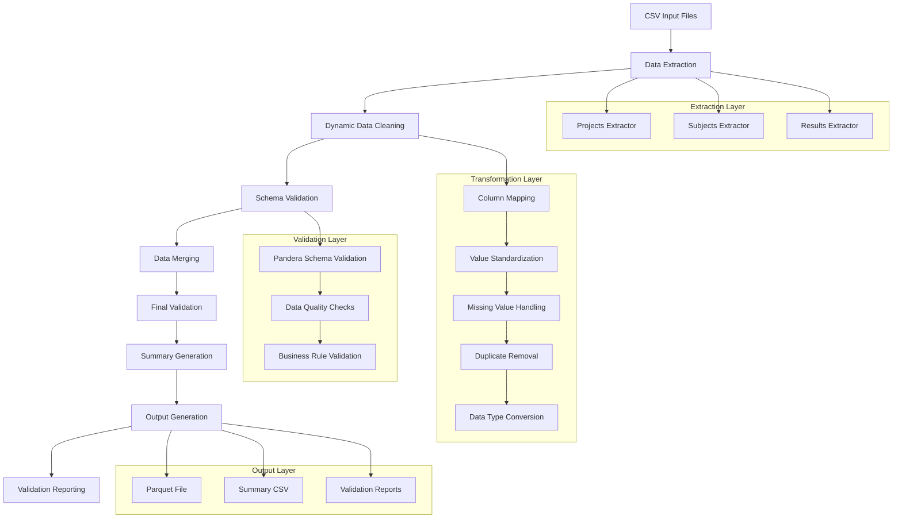

# Data Pipeline ETL System

A robust, modular ETL (Extract, Transform, Load) pipeline system designed for processing CSV data with advanced validation, cleaning, and reporting capabilities. Built with Python, Pandera, and a config-driven architecture for maximum flexibility and maintainability.

## 🆕 Latest Version: v2.1.0

### Key Features
- **📊 Comprehensive Data Quality Reports**: Detailed transformation analysis and validation reporting
- **🔧 Dynamic Path Resolution**: Automatic path detection for flexible deployment
- **📈 Advanced Validation**: Pandera-based validation with detailed error reporting
- **🎯 Actionable Insights**: Detailed recommendations for data quality improvements
- **🔄 Auto-updating Reports**: Real-time data quality monitoring

## 📋 Table of Contents

- [Overview](#overview)
- [Architecture & Design](#architecture--design)
- [File Structure](#file-structure)
- [Data Flow](#data-flow)
- [Usage](#usage)
- [Recipe Transformer System](#recipe-transformer-system)
- [Pandera Integration](#pandera-integration)
- [AI Agent Integration](#ai-agent-integration)
- [Installation](#installation)
- [Configuration](#configuration)
- [Testing](#testing)
- [Docker Support](#docker-support)
- [Contributing](#contributing)

## 🎯 Overview

This ETL pipeline system processes three CSV files containing project, subject, and results data, transforming them into a unified Parquet format with comprehensive validation and reporting. The system features:

- **Modular Architecture**: Clean separation of concerns with extractors, transformers, and loaders
- **Dynamic Data Cleaning**: Schema-driven cleaning with automatic recipe generation
- **Advanced Validation**: Pandera-based validation with detailed error reporting
- **Config-Driven**: YAML-based configuration for easy customization
- **Comprehensive Reporting**: Technical and summary validation reports
- **Data Quality Reports**: Detailed text-based reports with transformation analysis
- **Docker Support**: Containerized deployment ready

## 🏗️ Architecture & Design

### Core Design Principles

1. **Separation of Concerns**: Each component has a single responsibility
2. **Extensibility**: Easy to add new extractors, transformers, or loaders
3. **Config-Driven**: Behavior controlled by configuration files
4. **Validation-First**: Data quality enforced at every step
5. **Observability**: Comprehensive logging and reporting
6. **Modularity**: Components can be used independently

### Main Design Ideas

- **Pipeline Pattern**: Sequential processing with clear data flow
- **Factory Pattern**: Dynamic component instantiation
- **Strategy Pattern**: Pluggable transformation strategies
- **Observer Pattern**: Validation reporting and monitoring
- **Configuration Pattern**: Externalized behavior control

## 📁 File Structure

```
data_pipeline/
├── 📁 config/                          # Configuration Management
│   ├── __init__.py
│   └── config_manager.py              # Centralized config management
├── 📁 core/                           # Core Pipeline Components
│   ├── 📁 extract/                    # Data Extraction Layer
│   │   ├── __init__.py
│   │   ├── base_extractor.py         # Abstract base extractor
│   │   ├── projects_extractor.py     # Projects data extraction
│   │   ├── subjects_extractor.py     # Subjects data extraction
│   │   └── results_extractor.py      # Results data extraction
│   ├── 📁 load/                       # Data Loading Layer
│   │   ├── __init__.py
│   │   ├── base_loader.py            # Abstract base loader
│   │   ├── parquet_loader.py         # Parquet output loader
│   │   └── summary_loader.py         # Summary CSV loader
│   ├── 📁 pipeline/                   # Pipeline Orchestration
│   │   ├── __init__.py
│   │   ├── data_pipeline.py          # Main pipeline orchestrator
│   │   └── pipeline_steps.py         # Individual pipeline steps
│   ├── 📁 transform/                  # Data Transformation Layer
│   │   ├── __init__.py
│   │   ├── base_transformer.py       # Abstract base transformer
│   │   ├── data_merger.py            # Data merging logic
│   │   ├── dynamic_data_transformer.py   # Dynamic transformation system
│   │   ├── summary_transformer.py    # Summary generation
│   │   └── transformation_recipe.py  # Recipe-based transformations
│   └── 📁 utils/                      # Core Utilities
│       ├── __init__.py
│       └── 📁 reporting/              # Validation Reporting
│           ├── validation_reporter.py      # Main reporter
│           ├── technical_report_generator.py  # Technical reports
│           ├── summary_report_generator.py    # Summary reports
│           ├── data_quality_report_generator.py  # Data quality reports
│           └── report_cleaner.py            # Report cleanup
├── 📁 utils/                          # Project Utilities
│   ├── 📁 exceptions/                 # Exception Handling
│   │   ├── __init__.py
│   │   └── pipeline_exceptions.py    # Custom exceptions
│   └── 📁 schemas/                   # Schema Definitions
│       ├── __init__.py
│       └── schemas.py                # Pandera schemas
├── 📁 file_store/                     # Data Storage
│   ├── 📁 input/                      # Input CSV files
│   │   ├── excel_1_project_study_cohort.csv
│   │   ├── excel_2_subject_samples.csv
│   │   └── excel_3_sample_run_results.csv
│   ├── 📁 output/                    # Output files
│   │   ├── output.parquet
│   │   └── summary.csv
│   ├── 📁 recipes/                    # Transformation recipes
│   │   ├── transformation_recipe_projects.json
│   │   ├── transformation_recipe_subjects.json
│   │   └── transformation_recipe_results.json
│   └── 📁 reports/                    # Validation reports
│       ├── 📁 summary/               # Summary reports
│       ├── 📁 technical/             # Technical reports
│       └── data_quality_summary.txt  # Data quality report
├── 📁 tests/                          # Test Suite
│   ├── __init__.py
│   ├── test_extractors.py
│   ├── test_pipeline.py
│   └── test_validation_reporting_integration.py
├── 📄 main.py                         # CLI entry point
├── 📄 local_main.py                   # Local development entry
├── 📄 config.yaml                     # Main configuration
├── 📄 requirements.txt                # Python dependencies
├── 📄 Dockerfile                      # Docker configuration
├── 📄 docker-compose.yml              # Docker Compose setup
└── 📄 README.md                       # This file
```

## 🔄 Data Flow



### Data Flow Description

1. **Extraction Phase**: Three CSV files are read using specialized extractors
2. **Cleaning Phase**: Dynamic cleaning applies transformation recipes
3. **Validation Phase**: Pandera schemas validate data quality
4. **Merging Phase**: Data from all sources is merged into a unified dataset
5. **Output Phase**: Results are saved as Parquet and summary CSV
6. **Reporting Phase**: Validation reports are generated for quality assurance

## 🚀 Usage

### Quick Start

```bash
# Clone the repository
git clone <repository-url>
cd data_pipeline

# Install dependencies
pip install -r requirements.txt

# Run the pipeline
python main.py
```

### Command Line Interface

```bash
# Run with custom input/output directories
python main.py --input /path/to/input --output /path/to/output

# Run with dry-run mode
python main.py --dry-run

# Run with verbose logging
python main.py --verbose

# Run with custom config
python main.py --config custom_config.yaml
```

### Docker Usage

```bash
# Build the Docker image
docker build -t data-pipeline .

# Run the container
docker run -v $(pwd)/file_store:/app/file_store data-pipeline

# Using Docker Compose
docker-compose up
```

## 🔧 Recipe Transformer System

The Recipe Transformer System is the heart of our dynamic data cleaning approach. It automatically generates transformation recipes based on Pandera schema analysis and applies them to clean data systematically.

### How It Works

1. **Schema Analysis**: The system analyzes Pandera schemas to understand data requirements
2. **Recipe Generation**: Transformation steps are automatically generated based on schema rules
3. **Dynamic Application**: Recipes are applied to data with configurable parameters
4. **Validation**: Cleaned data is validated against the original schemas
5. **Reporting**: Transformation results are documented in detailed reports

### Recipe Components

```json
{
  "file_type": "results",
  "generated_at": "2025-09-25T23:19:38",
  "steps": [
    {
      "step_number": 1,
      "step_name": "column_mapping",
      "description": "Map CSV column names to schema column names",
      "parameters": {
        "column_mappings": {
          " detection_value ": "detection_value",
          "cancer_detected_(yes_no)": "cancer_detected"
        }
      }
    },
    {
      "step_number": 2,
      "step_name": "value_mapping",
      "description": "Standardize data values",
      "parameters": {
        "value_mappings": {
          "sample_status": {
            "finished": "Finished",
            "running": "Running"
          }
        }
      }
    }
  ]
}
```

### Benefits of Recipe System

- **Automated Cleaning**: No manual intervention required
- **Reproducible**: Same transformations applied consistently
- **Configurable**: Easy to modify cleaning rules
- **Traceable**: Full audit trail of transformations
- **Extensible**: Easy to add new transformation types

## 🛡️ Pandera Integration

Pandera provides powerful data validation capabilities that form the foundation of our data quality assurance system.

### Schema Definition

```python
class ResultsSchema:
    @staticmethod
    def get_schema():
        return DataFrameSchema({
            "sample_id": Column(str, description="Sample identifier"),
            "detection_value": Column(
                float,
                description="Detection value",
                checks=[Check.ge(0.0), Check.le(1.0)],
                nullable=True
            ),
            "cancer_detected": Column(
                str,
                description="Cancer detection result",
                checks=Check.isin(['Yes', 'No', 'Y', 'N']),
                nullable=True
            )
        }, coerce=True, strict=False)
```

### Pandera Advantages

1. **Type Safety**: Automatic type checking and conversion
2. **Data Quality**: Built-in validation rules and constraints
3. **Performance**: Efficient validation with lazy evaluation
4. **Flexibility**: Custom validation functions and checks
5. **Integration**: Seamless pandas DataFrame integration
6. **Error Reporting**: Detailed validation error information

### Validation Benefits

- **Data Integrity**: Ensures data meets business requirements
- **Error Detection**: Identifies data quality issues early
- **Automated Checks**: Reduces manual data validation effort
- **Documentation**: Schemas serve as data documentation
- **Regression Prevention**: Catches data quality regressions

## 📊 Data Quality Reporting System

The system includes a comprehensive data quality reporting system that provides detailed insights into data transformations, validation results, and actionable recommendations.

### Report Features

- **📈 Executive Summary**: Overall pipeline status, success rates, and processing results
- **🔧 Transformation Analysis**: Detailed view of column mappings and value transformations
- **🚨 Critical Issues**: Identification and analysis of data quality problems
- **📊 Data Quality Metrics**: Processing statistics and transformation success rates
- **🎯 Actionable Recommendations**: Specific steps to improve data quality
- **🔄 Auto-updating**: Single report file that updates with each pipeline run

### Report Location

The comprehensive data quality report is automatically generated at:
```
file_store/reports/data_quality_summary.txt
```

### Report Content

The report includes:

1. **Executive Summary**: Overall status and success rates
2. **Data Transformation Analysis**: 
   - Column mappings (original → mapped names)
   - Value mappings (showing what values were changed and how)
3. **Critical Issues**: Detailed analysis of schema validation failures
4. **Data Quality Metrics**: Processing statistics and transformation success rates
5. **Recommended Actions**: Immediate and medium-term priorities
6. **File Locations**: All generated files and configuration locations
7. **Next Steps**: Actionable items for improvement

### Example Report Output

```
================================================================================
                    DATA PIPELINE VALIDATION & TRANSFORMATION REPORT
================================================================================
Generated: 2025-09-26 17:27:43
Report Type: Data Quality & Transformation Summary
Version: 1.0.0

================================================================================
                              EXECUTIVE SUMMARY
================================================================================

OVERALL STATUS: ❌  FAILED
Data Quality Status: CRITICAL
Success Rate: 20.0%
Total Errors: 4 critical schema errors

PIPELINE PROCESSING RESULTS:
✅ Projects: 23 records processed successfully
✅ Subjects: 2,718 records processed successfully  
⚠️  Results: 1,893 records processed (825 records filtered due to data quality issues)
✅ Merged: 1,465 final records
✅ Summary: 20 records
```

## 🔧 Configuration

The system uses YAML configuration files for easy customization and deployment.

## 📦 Installation

### Prerequisites

- Python 3.9+
- pip
- Docker (optional)

### Local Installation

```bash
# Clone the repository
git clone <repository-url>
cd data_pipeline

# Create virtual environment
python -m venv venv
source venv/bin/activate  # On Windows: venv\Scripts\activate

# Install dependencies
pip install -r requirements.txt
```

### Docker Installation

```bash
# Build the image
docker build -t data-pipeline .

# Run the container
docker run -v $(pwd)/file_store:/app/file_store data-pipeline
```

## ⚙️ Configuration

The system uses YAML configuration files for easy customization:

```yaml
# config.yaml
data:
  input_dir: "file_store/input"
  output_dir: "file_store/output"
  
  column_mappings:
    results:
      " detection_value ": "detection_value"
      "cancer_detected_(yes_no)": "cancer_detected"
  
  value_mappings:
    results:
      sample_status:
        "finished": "Finished"
        "running": "Running"

logging:
  level: "INFO"
  format: "%(asctime)s - %(levelname)s - %(message)s"
```

## 🧪 Testing

Run the test suite:

```bash
# Run all tests
python -m pytest tests/

# Run specific test categories
python -m pytest tests/test_extractors.py
python -m pytest tests/test_pipeline.py
python -m pytest tests/test_validation_reporting_integration.py

# Run with coverage
python -m pytest --cov=core tests/
```

## 🐳 Docker Support

### Dockerfile

```dockerfile
FROM python:3.9-slim

WORKDIR /app
COPY requirements.txt .
RUN pip install -r requirements.txt

COPY . .
CMD ["python", "main.py"]
```

### Docker Compose

```yaml
version: '3.8'
services:
  data-pipeline:
    build: .
    volumes:
      - ./file_store:/app/file_store
    environment:
      - LOG_LEVEL=INFO
```

## 🤝 Contributing

1. Fork the repository
2. Create a feature branch
3. Make your changes
4. Add tests for new functionality
5. Run the test suite
6. Submit a pull request

## 📄 License

This project is licensed under the MIT License - see the LICENSE file for details.

## 🆘 Support

For support and questions:
- Create an issue in the repository
- Check the documentation
- Review the test cases for examples

---

**Built with ❤️ for data quality and reliability**